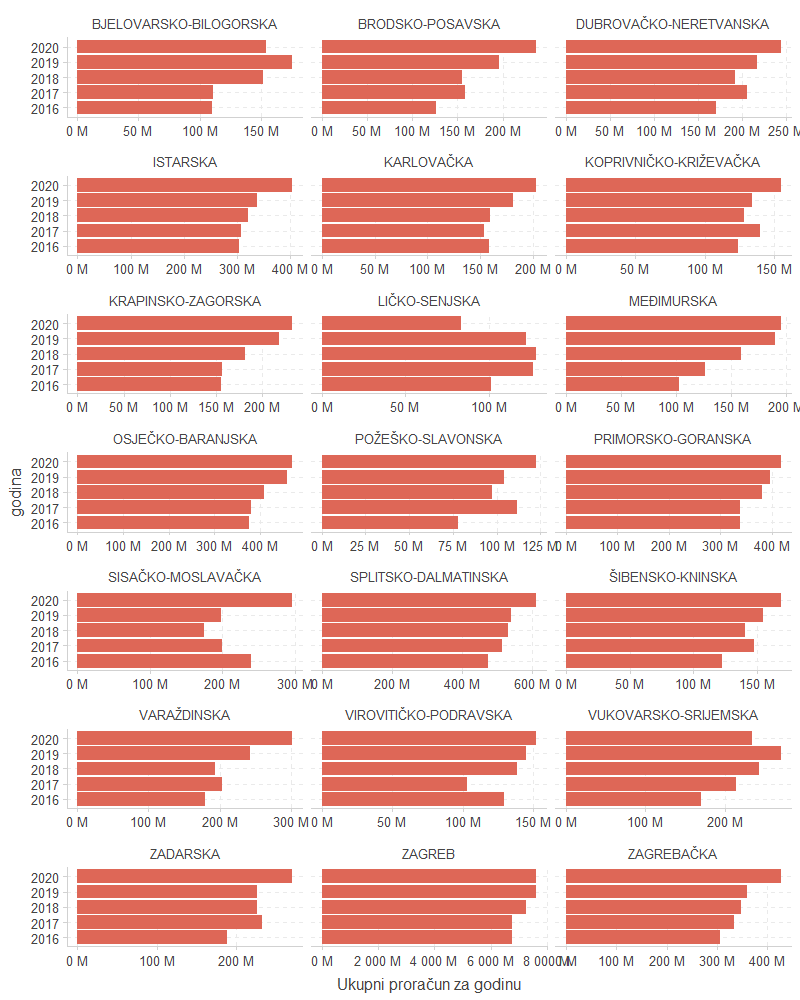

Proračuni jedinica lokalne samouprave (JLS) - obrada podataka Ministarstva financija. Podaci su dostupni za gradove, općine i županije.

Ova skripta:

1. Učitava podatke o proračunima JLS
2. Standardizira nazive kolona
3. Spaja sve datoteke u jednu tablicu s dodatnim atributom proračunske godine
4. Standardizira nazive gradova i općina
5. Spaja podatke na šifrarnik gradova i općina kako bi se dobio matični broj JLS za potrebe daljnjih spajanja podataka
6. Exporta podatke kao CSV (encoding = _windows-1250_) i RDS objekt

Izvori podataka:

1. [Ministarstvo financija: proračuni JLS](https://mfin.gov.hr/istaknute-teme/koncesije-i-drzavne-potpore/prirodne-nepogode/izvorni-prihodi-jls-u-republici-hrvatskoj/486)
2. Državno izborno povjerenstvo: šifrarnik grafova i općina

Primjer agregiranja proračunskih podataka prema županiji i godini:

